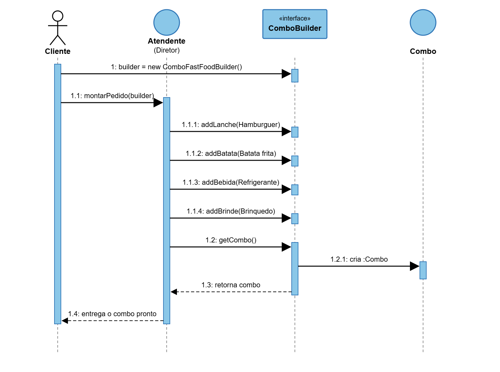

# Diagrama de Sequência — Padrão Builder 

DESIREE E NICOLE

## Participantes do diagrama

**Cliente**
Representa o usuário que deseja montar um combo. É ele quem inicia todo o processo de pedido.

**Atendente (Diretor)**
No padrão Builder, esse papel é conhecido como Diretor. Ele é responsável por fazer a ordem de montagem do combo, mas não conhece os detalhes de como cada item é adicionado essa responsabilidade é do Builder.

**ComboBuilder («interface»)**
É a interface que define os métodos de montagem do combo. Por ser uma interface, o Atendente não precisa conhecer a implementação concreta que está sendo usada, apenas os métodos disponíveis. O Diretor depende de uma abstração, não de uma classe específica.

**Combo**
Representa o produto final, criado só depois que todos os itens foram definidos pelo Builder.

As linhas verticais tracejadas abaixo de cada participante representam a linha do tempo de cada objeto durante a execução. As barras azuis indicam os períodos em que cada participante está executando alguma ação.

## Sequência de mensagens

**1 — Criação do Builder**
O Cliente cria uma instância concreta do Builder`ComboFastFoodBuilder`, que implementa a interface `ComboBuilder`.

**1.1 — Envio do pedido ao Atendente**
O Cliente entrega essa instância ao Atendente, solicitando que o pedido seja montado.

**1.1.1 — Adição do lanche**
O Atendente solicita ao Builder que adicione o lanche ao combo.

**1.1.2 — Adição da batata**
O Atendente solicita a adição da batata frita.

**1.1.3 — Adição da bebida**
O Atendente solicita a adição do refrigerante.

**1.1.4 — Adição do brinde**
O Atendente solicita a adição do brinde que acompanha o combo.

Essas quatro chamadas seguem o mesmo padrão: o Atendente instrui o Builder, um item por vez, respeitando a ordem definida para a montagem.

**1.2 — Solicitação do combo finalizado**
Após adicionar todos os itens, o Atendente solicita ao Builder o combo pronto, por meio do método `getCombo()`.

**1.2.1 — Criação do objeto Combo**
É nesse momento que o Builder efetivamente cria o objeto `Combo`, reunindo tudo o que foi definido nas etapas anteriores.

**1.3 — Retorno do combo ao Atendente**
O Builder devolve o objeto `Combo` recém-criado ao Atendente. Essa mensagem é representada por uma seta tracejada, por se tratar de um retorno, e não de uma nova solicitação.

**1.4 — Entrega ao Cliente**
Por fim, o Atendente entrega o combo pronto ao Cliente, finalizando o fluxo.

## Observação sobre o padrão aplicado

O Atendente (Diretor) nunca interage diretamente com o produto final durante a montagem ele apenas emite instruções sequenciais ao Builder. Quem monta e entrega o combo é o Builder. Se precisar seja criar uma variação do combo tipo um combo vegetariano ou um combo infantil, é só implementar um novo Builder que use a mesma interface. A lógica do Atendente permanece sem mudar, porque ele depende só da abstração ComboBuilder, e não de uma implementação específica.

DESIREE E NICOLE
